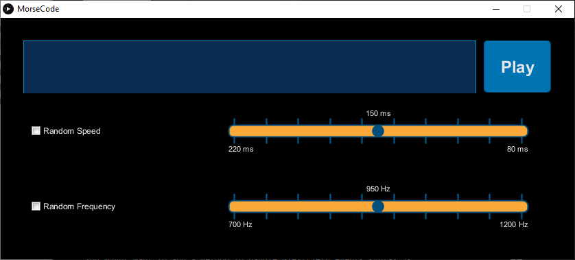

# Morse-Code-Translator
This is a project I made over a couple of days in Processing. It transforms text into international standard (M.1677) morse code  which is output to speakers. This presents as a small GUI window that allows you to enter the text you want translated. It also has sliders that let you adjust the speed and frequency of the sound.

## So what?
I'm presenting this project because it presents specific skills.
* An ability to organize and comment code into understandable chunks.
* An ability to understand and translate written standards. This follows the [M.1677 International Morse Code Recommendation](https://www.itu.int/rec/R-REC-M.1677-1-200910-I/).

## Installation
Three things need to be done to run the program.
1. Download Processing which is available from https://processing.org/
2. In processing, go to sketch -> immport library -> add library. Then search and install the `G4P` and `Sound` Library.
3. Open MorseCode.pde and click run.
Note: Due to limitations of the G4P library the GUI may appear very small on high density displays.
